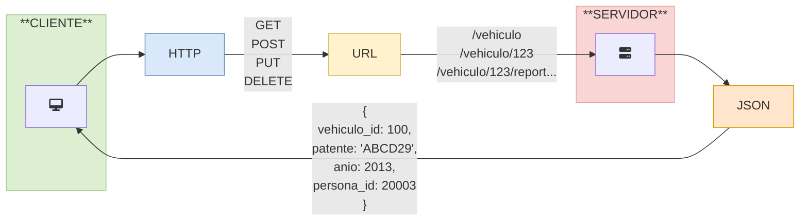

# Fundamentos HTTP y REST

## ¿Qué es la web y cómo funciona?

Es una red de redes de computadores.

Muchas páginas web hacen un sitio web.

La web funciona con un modelo cliente-servidor. El cliente envía solicitudes al
servidor, y el servidors responde con el contenido solicitado.

Una página web por lo general organiza su contenido en:

- Header o cabecera
- Body o contenido
- Footer o pie de página

### HTML

Utiliza etiquetas o tags para demarcar contenido. Por ejemplo,
`<h1>Título</h1>`.

## Conceptos HTTP

HyperText Transfer Protocol, es un protocolo que se utiliza en la web para
transferir páginas html.

## Métodos y respuestas de HTTP

> Recurso -> un registro dentro del sistema. Pueden ser datos, texto, audio,
> img, etc.

- **GET:** Solicitar datos al servidor.
- **POST:** Enviar datos al servidor para generar un nuevo recurso.
- **PUT:** Reemplazar por completo un recurso existente.
- **DELETE:**
- **HEAD:** Similar a GET, pero no devuelve el body de la respuesta solo los
  headers.
- **OPTIONS:**
- **PATCH:** Realiza una actualización parcial de un recurso.

### Estructura de la respuesta

- Línea de estado: El código de la respuesta y una breve descripción.
- Cabecera HTTP: Información adicional de la respuesta, una especie de metadata
  de la transacción.
- Body: Contiene los datos solicitados

## REST

### ¿Qué se entiende por REST?

### Ventajas

Simplicidad, escalabilidad, flexibilidad e interoperabilidad

### Buenas prácticas

Nombres descriptivos y consistentes.

Utiliza sustantivos en plural para los nombres de los recursos.

| Sí                             | No                           |
| ------------------------------ | ---------------------------- |
| `api/v1/productos`             | `/api/v1/producto`           |
| `/api/v1/estudiantes/11/notas` | `/obtenerNotasEstudiante/11` |

#### Ejemplo librería

| API                  | MÉTODO HTTP | PATH                  | CÓDIGO DE ESTADO | DESCRIPCIÓN                    |
| -------------------- | ----------- | --------------------- | ---------------- | ------------------------------ |
| **Listar libros**    | GET         | `/api/v1/libros`      | 200 (OK)         | Se recupera todos los recursos |
| **Guardar libro**    | POST        | `/api/v1/libros`      | 201 (Created)    | Se crea un nuevo recurso       |
| **Obtener libro**    | GET         | `/api/v1/libros/{id}` | 200 (OK)         | Se recupera un recurso         |
| **Actualizar libro** | PUT         | `/api/v1/libros/{id}` | 200 (OK)         | Se actualiza un recurso        |
| **Eliminar libro**   | DELETE      | `/api/v1/libros/{id}` | 204 (No Content) | Se elimina un recurso          |

#### Ejemplo préstamos

| API                 | MÉTODO HTTP | PATH                     | CÓDIGO DE ESTADO | DESCRIPCIÓN                    |
| ------------------- | ----------- | ------------------------ | ---------------- | ------------------------------ |
| Listar prestamos    | GET         | `/api/v1/prestamos`      | 200 (OK)         | Se recupera todos los recursos |
| Guardar prestamo    | POST        | `/api/v1/prestamos`      | 201 (Created)    | Se crea un nuevo recurso       |
| Obtener prestamo    | GET         | `/api/v1/prestamos/{id}` | 200 (OK)         | Se recupera un recurso         |
| Actualizar prestamo | PUT         | `/api/v1/prestamos/{id}` | 200 (OK)         | Se actualiza un recurso        |
| Eliminar prestamo   | DELETE      | `/api/v1/prestamos/{id}` | 204 (No Content) | Se elimina un recurso          |

